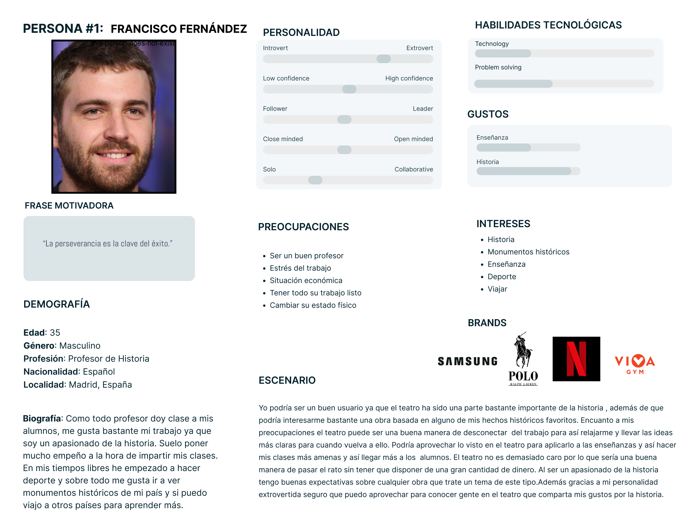
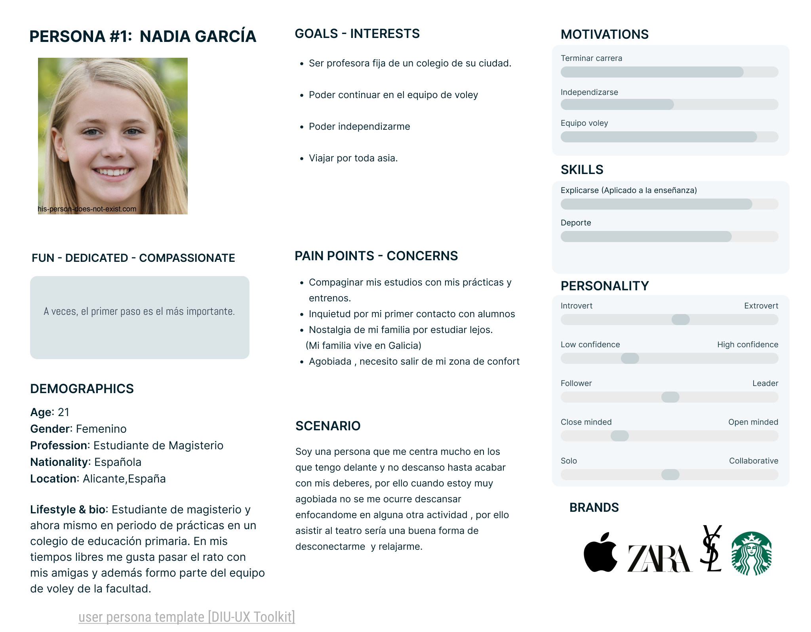
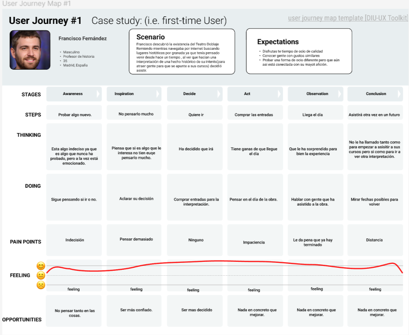
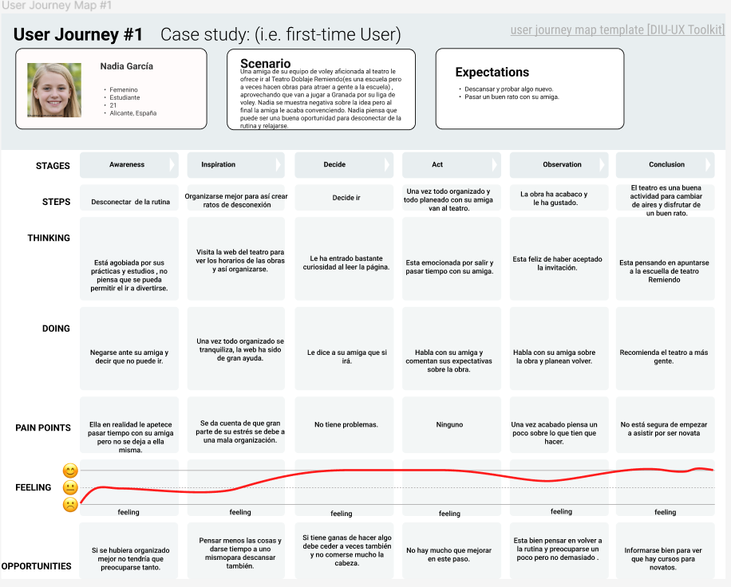

# DIU24
Prácticas Diseño Interfaces de Usuario 2023-24 (Tema: .... ) 

Grupo: DIU1_01AABB.  Curso: 2023/24 
Updated: 11/2/2024

Proyecto: 
>>> Decida el nombre corto de su propuesta en la práctica 2 

Descripción: 

>>> Describa la idea de su producto en la práctica 2 

Logotipo: 
>>> Opcionalmente si diseña un logotipo para su producto en la práctica 3 pongalo aqui

Miembros
 * :bust_in_silhouette:   Kaito Francisco Lorenzo Okochi     :octocat:     
 * :bust_in_silhouette:  Antonio Fernández Santiago     :octocat:

----- 

# Proceso de Diseño 

## Paso 1. UX User & Desk Research & Analisis 

 **1.a User Reseach Plan**
-----

>>> Describe el plan de User Research (cómo se planteas)

El plan de investigación del usuario se basa en una combinación de métodos de investigación primaria para obtener una comprensión profunda de cómo los usuarios organizan la iniciativa de asistir a una escuela de teatro.

Objetivos del Proyecto: El objetivo principal es comprender cómo los usuarios organizan esta iniciativa para mejorar y atraer más su atención hacia la escuela de teatro.

Objetivos Empresariales y KPIs: Se establecen tres objetivos empresariales clave junto con sus indicadores de rendimiento (KPIs) asociados: aumentar el número de usuarios, mejorar la calidad de la enseñanza y aumentar el reconocimiento de la escuela de teatro.

Criterios de Éxito de la Investigación: Se especifican los criterios cualitativos y cuantitativos para recopilar información sobre los usuarios, incluyendo motivaciones, preferencias, experiencias anteriores y feedback para mejorar.

Métodos de Investigación Primaria: Se incluyen varios métodos de investigación primaria, como observación etnográfica, entrevistas de usuario, indagación contextual, pruebas de usabilidad y encuestas post-sesión, cada uno con una breve explicación de su propósito y metodología.

Alcance y Áreas de Enfoque de la Investigación: Se identifican y se describen los temas de preguntas principales, que se centran en motivaciones e intereses, proceso de selección y evaluación, planificación y preparación, expectativas y experiencias anteriores, y feedback para mejoras.

Componentes de Enfoque del Diseño: Se eligen tres componentes de enfoque de diseño: utilidad, facilidad de aprendizaje y satisfacción, que guiarán el diseño y la mejora de la experiencia del usuario en la escuela de teatro.

En resumen, el plan de investigación del usuario tiene como objetivo proporcionar una comprensión completa de las necesidades, deseos y experiencias de los usuarios, así como generar información valiosa para mejorar la oferta y la experiencia en la escuela de teatro. 

Plantilla: [Pulse aquí para ver](P1/P1-2b%20User%20Research.pdf)

 1.b Competitive Analysis
-----

>>> Describe brevemente características de las aplicaciones que tienes asignadas, y por qué has elegido una de ellas

Hemos elegido de las dos opciones propuestas la escuela de teatro y doblaje Remiendo(https://escueladeteatroengranada.es/) y como competencias La Petite, de Granada(https://www.escuelapetite.com/) y Escuela de Doblaje de Madrid ( https://escueladedoblajedemadrid.es/).

Para realizar la tabla hemos usado la plantilla de Figma: 
[Pulse aquí para ver](P1/Análisis%20de%20Competidores%20(1).pdf)

Después de hacer el análisis podríamos decir las siguientes características de cada una:

- Remiendo: Tiene buenos cursos, variados según nivel o edad, con profesores de calidad y con buenos precios, pero su web presenta una barra de navegación algo extensa y una carga lenta ya que cada vez que se quiere cambiar de página aparece el logo en grande unos segundos.
- La Petite: Tiene variedad de cursos, también según edad o nivel y de calidad, su web tiene buen diseño pero para cierta información hay que enviar una solicitud, como por ejemplo para saber los precios.
- Escuela de Doblaje: Tiene mucha variedad de actividades con profesores de calidad, pero no da detalles como precios o variedad según nivel o edad ya que para casi todo es necesario enviar una solicitud, por lo demás su página tiene un buen diseño y carga normal.

Hemos elegido estas opciones ya que una es de Granada, para así compararla con una de la misma ciudad, y la otra a nivel nacional, además como Remiendo tiene tanto teatro como doblaje, hemos elegido un competidor de teatro y otro de doblaje.

 1.c Persona
-----

-----

Hemos seleccionado a Francisco y a Nadia ya que ambos nos parecían candidatos idóneos para este caso, por una parte Francisco es aficionado a la Historia y en busca de monumentos históricos se topó conla esula de teatro que anunciaba una obra de exibición que abordaba un tema de su interés. Nadia es seleccionada sobre todo como usuaria ya que debido a su situación puede venirle muy bien descubrir una nueva afición que ke ayude a desconectar de su rutina.

 1.d User Journey Map
----

Creemos que estas situcaiones pueden ser habituales ya que hoy ne día no hay mucha afición por el teatro así que es habitual el tipo de situación de pensar si es buena idea ir por primera vez y luego pensar en como ha sido esa nueva experiencia.

 1.e Usability Review
----
Enlace al documento:
https://github.com/AntonioFdez03/PracticasDIU/blob/master/P1/Usability-review.pdf
Valoración final (numérica): 71

Tras rellenar la plantilla del usability-review la página obtiene un 71 de puntuación lo que es una nota bastante elevada. La página cumple con su función pero tine varios detalles a mejorar.

## Paso 2. UX Design  

 2.a Reframing / IDEACION: Feedback Capture Grid / EMpathy map 
----

>>> Comenta con un diagrama los aspectos más destacados a modo de conclusion de la práctica anterior,

 Interesante | Críticas     
| ------------- | -------
  Preguntas | Nuevas ideas
  
    
"Facilitación de la conexión entre usuarios para intercambiar servicios y recursos de manera colaborativa, optimizando el uso de recursos y fomentando la comunidad."

 2.b ScopeCanvas
----

>>> Propuesta de valor 

 2.b User Flow (task) analysis 
-----

>>> Definir "User Map" y "Task Flow" ... 

Este sería el flujo de acciones que hará el usuario al entrar en la web, en el que intervienen las acciones iniciar sesión, registrarse y navegar con el menú.

 2.c IA: Sitemap + Labelling 
----

>>> Identificar términos para diálogo con usuario  

Término | Significado     
| ------------- | -------
  Login  | acceder a plataforma
  Streaming  | contenido de medios, ya sea en vivo o grabado, que se puede disfrutar en computadoras y aparatos móviles a través de internet y en tiempo real. 
  E-Sports   |  deportes electrónicos o ciberdeportes son competiciones que tienen lugar en el entorno de los videojuegos.

 2.d Wireframes
-----

>>> Plantear el  diseño del layout para Web/movil (organización y simulación )

Este sería el diseño de la página inicial para móvil y ordenador.
[Pulse aquí para ver la simulación](https://www.figma.com/file/bOH2KvYVqzZ9Kxxh2E6Zwt/Layouts?type=design&mode=design&t=bTKrzUWY60RW2PaV-0)

Estos serían los diseños para las otras páginas: Login, Sobre nosotros, Reserva y Contacto.

## Paso 3. Mi UX-Case Study (diseño)

 3.a Moodboard
-----

>>> Plantear Diseño visual con una guía de estilos visual (moodboard) 
>>> Incluir Logotipo
>>> Si diseña un logotipo, explique la herramienta utilizada y la resolución empleada. ¿Puede usar esta imagen como cabecera de Twitter, por ejemplo, o necesita otra?

  3.b Landing Page
----

>>> Plantear Landing Page 

 3.c Guidelines
----

>>> Estudio de Guidelines y Patrones IU a usar 
>>> Tras documentarse, muestre las deciones tomadas sobre Patrones IU a usar para la fase siguiente de prototipado. 

  3.d Mockup
----

>>> Layout: Mockup / prototipo HTML  (que permita simular tareas con estilo de IU seleccionado)

 3.e ¿My UX-Case Study?
-----

>>> Publicar my Case Study en Github..
>>> Documente y resuma el diseño de su producto

## Paso 5. Exportación & evaluación con Eye Tracking 

Exportación a HTML/Flutter
-----

)  5.b Eye Tracking method 

>>> Indica cómo diseñas experimento y reclutas usuarios (uso de gazerecorder.com)  

Diseño del experimento 
----

>> Uso de imágenes (preferentemente) -> hay que esablecer una duración de visualización y  
>> fijar las áreas de interes (AoI) antes del diseño. Planificar qué tarea debe hacer el usuario (buscar, comprar...) 

  
>> cambiar img por tu diseño de experimento  

>> Recordar que gazerecorder es una versión de pruebas: usar sólo con 3 usuarios para generar mapa de calor (recordar que crédito > 0 para que funcione) 

Resultados y valoración 
-----

>> Cambiar por tus resultados
  

## Paso 4. Evaluación 

 4.a Caso asignado
----

>>> Breve descripción del caso asignado con enlace a  su repositorio Github

 4.b User Testing
----

>>> Seleccione 4 personas ficticias. Exprese las ideas de posibles situaciones conflictivas de esa persona en las propuestas evaluadas. Asigne dos a Caso A y 2 al caso B
 

| Usuarios | Sexo/Edad     | Ocupación   |  Exp.TIC    | Personalidad | Plataforma | TestA/B
| ------------- | -------- | ----------- | ----------- | -----------  | ---------- | ----
| User1's name  | H / 18   | Estudiante  | Media       | Introvertido | Web.       | A 
| User2's name  | H / 18   | Estudiante  | Media       | Timido       | Web        | A 
| User3's name  | M / 35   | Abogado     | Baja        | Emocional    | móvil      | B 
| User4's name  | H / 18   | Estudiante  | Media       | Racional     | Web        | B 

 4.c Cuestionario SUS
----

>>> Usaremos el **Cuestionario SUS** para valorar la satisfacción de cada usuario con el diseño (A/B) realizado. Para ello usamos la [hoja de cálculo](https://github.com/mgea/DIU19/blob/master/Cuestionario%20SUS%20DIU.xlsx) para calcular resultados sigiendo las pautas para usar la escala SUS e interpretar los resultados
http://usabilitygeek.com/how-to-use-the-system-usability-scale-sus-to-evaluate-the-usability-of-your-website/)
Para más información, consultar aquí sobre la [metodología SUS](https://cui.unige.ch/isi/icle-wiki/_media/ipm:test-suschapt.pdf)

>>> Adjuntar captura de imagen con los resultados + Valoración personal 

 4.d Usability Report
----

>> Añadir report de usabilidad para práctica B (la de los compañeros)

>>> Valoración personal 

5.) Conclusion de EVALUACION (A/B testing + usability report + eye tracking) 
----

>> recupera el usability report de tu práctica (que es el caso B de los asignados a otros grupos) 
>> con los resultados del A/B testing, de eye tracking y del usability report:
>>  comentad en 2-3 parrafos cual es la conclusion acerca de la realización de la práctica y su evaluación con esas técnicas y que habéis aprendido

## Conclusión final / Valoración de las prácticas

>>> (90-150 palabras) Opinión FINAL del proceso de desarrollo de diseño siguiendo metodología UX y valoración (positiva /negativa) de los resultados obtenidos  

