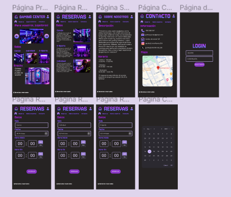
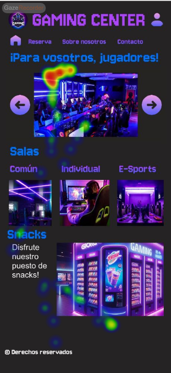

# DIU24
Prácticas Diseño Interfaces de Usuario 2023-24 (Tema: .... ) 

Grupo: DIU1_01AABB.  Curso: 2023/24 
Updated: 11/2/2024

## GAMING CENTER

Local para los amantes de los videojuegos, con juegos y salas de todo tipo para que cada cliente disfrute de la manera que más le guste, con puesto de snack.

Logotipo: 

Miembros
 * :bust_in_silhouette:   Kaito Francisco Lorenzo Okochi     :octocat:     
 * :bust_in_silhouette:  Antonio Fernández Santiago     :octocat:

----- 

# Proceso de Diseño 

## Paso 1. UX User & Desk Research & Analisis 

 **1.a User Reseach Plan**
-----

>>> Describe el plan de User Research (cómo se planteas)

El plan de investigación del usuario se basa en una combinación de métodos de investigación primaria para obtener una comprensión profunda de cómo los usuarios organizan la iniciativa de asistir a una escuela de teatro.

Objetivos del Proyecto: El objetivo principal es comprender cómo los usuarios organizan esta iniciativa para mejorar y atraer más su atención hacia la escuela de teatro.

Objetivos Empresariales y KPIs: Se establecen tres objetivos empresariales clave junto con sus indicadores de rendimiento (KPIs) asociados: aumentar el número de usuarios, mejorar la calidad de la enseñanza y aumentar el reconocimiento de la escuela de teatro.

Criterios de Éxito de la Investigación: Se especifican los criterios cualitativos y cuantitativos para recopilar información sobre los usuarios, incluyendo motivaciones, preferencias, experiencias anteriores y feedback para mejorar.

Métodos de Investigación Primaria: Se incluyen varios métodos de investigación primaria, como observación etnográfica, entrevistas de usuario, indagación contextual, pruebas de usabilidad y encuestas post-sesión, cada uno con una breve explicación de su propósito y metodología.

Alcance y Áreas de Enfoque de la Investigación: Se identifican y se describen los temas de preguntas principales, que se centran en motivaciones e intereses, proceso de selección y evaluación, planificación y preparación, expectativas y experiencias anteriores, y feedback para mejoras.

Componentes de Enfoque del Diseño: Se eligen tres componentes de enfoque de diseño: utilidad, facilidad de aprendizaje y satisfacción, que guiarán el diseño y la mejora de la experiencia del usuario en la escuela de teatro.

En resumen, el plan de investigación del usuario tiene como objetivo proporcionar una comprensión completa de las necesidades, deseos y experiencias de los usuarios, así como generar información valiosa para mejorar la oferta y la experiencia en la escuela de teatro. 

Plantilla: [Pulse aquí para ver](P1/P1-2b%20User%20Research.pdf)

 1.b Competitive Analysis
-----

>>> Describe brevemente características de las aplicaciones que tienes asignadas, y por qué has elegido una de ellas

Hemos elegido de las dos opciones propuestas la escuela de teatro y doblaje Remiendo(https://escueladeteatroengranada.es/) y como competencias La Petite, de Granada(https://www.escuelapetite.com/) y Escuela de Doblaje de Madrid ( https://escueladedoblajedemadrid.es/).

Para realizar la tabla hemos usado la plantilla de Figma: 
[Pulse aquí para ver](P1/Análisis%20de%20Competidores%20(1).pdf)

Después de hacer el análisis podríamos decir las siguientes características de cada una:

- Remiendo: Tiene buenos cursos, variados según nivel o edad, con profesores de calidad y con buenos precios, pero su web presenta una barra de navegación algo extensa y una carga lenta ya que cada vez que se quiere cambiar de página aparece el logo en grande unos segundos.
- La Petite: Tiene variedad de cursos, también según edad o nivel y de calidad, su web tiene buen diseño pero para cierta información hay que enviar una solicitud, como por ejemplo para saber los precios.
- Escuela de Doblaje: Tiene mucha variedad de actividades con profesores de calidad, pero no da detalles como precios o variedad según nivel o edad ya que para casi todo es necesario enviar una solicitud, por lo demás su página tiene un buen diseño y carga normal.

Hemos elegido estas opciones ya que una es de Granada, para así compararla con una de la misma ciudad, y la otra a nivel nacional, además como Remiendo tiene tanto teatro como doblaje, hemos elegido un competidor de teatro y otro de doblaje.

 1.c Persona
-----

-----

Hemos seleccionado a Francisco y a Nadia ya que ambos nos parecían candidatos idóneos para este caso, por una parte Francisco es aficionado a la Historia y en busca de monumentos históricos se topó conla esula de teatro que anunciaba una obra de exibición que abordaba un tema de su interés. Nadia es seleccionada sobre todo como usuaria ya que debido a su situación puede venirle muy bien descubrir una nueva afición que ke ayude a desconectar de su rutina.

 1.d User Journey Map
----

Creemos que estas situcaiones pueden ser habituales ya que hoy ne día no hay mucha afición por el teatro así que es habitual el tipo de situación de pensar si es buena idea ir por primera vez y luego pensar en como ha sido esa nueva experiencia.

 1.e Usability Review
----
Enlace al documento:
https://github.com/AntonioFdez03/PracticasDIU/blob/master/P1/Usability-review.pdf
Valoración final (numérica): 71

Tras rellenar la plantilla del usability-review la página obtiene un 71 de puntuación lo que es una nota bastante elevada. La página cumple con su función pero tine varios detalles a mejorar.

## Paso 2. UX Design  

 2.a Reframing / IDEACION: Feedback Capture Grid / EMpathy map 
----

>>> Comenta con un diagrama los aspectos más destacados a modo de conclusion de la práctica anterior,

 Interesante | Críticas     
| ------------- | -------
  Preguntas | Nuevas ideas
  
    
"Facilitación de la conexión entre usuarios para intercambiar servicios y recursos de manera colaborativa, optimizando el uso de recursos y fomentando la comunidad."

 2.b ScopeCanvas
----

>>> Propuesta de valor 

 2.b User Flow (task) analysis 
-----

>>> Definir "User Map" y "Task Flow" ... 

Este sería el flujo de acciones que hará el usuario al entrar en la web, en el que intervienen las acciones iniciar sesión, registrarse y navegar con el menú.
De primeras podrá navegar con el menú sin usar ninguna cuenta pero también podrá hacerlo en cualquier momento, iniciando sesión o creando primero una cuenta y luego iniciando sesión para usarla.
Navegando con el menú podemos llegar a cualquiera de las otras acciones.

 2.c IA: Sitemap + Labelling 
----

>>> Identificar términos para diálogo con usuario  

Término | Significado     
| ------------- | -------
  Login  | acceder a plataforma
  Streaming  | contenido de medios, ya sea en vivo o grabado, que se puede disfrutar en computadoras y aparatos móviles a través de internet y en tiempo real. 
  E-Sports   |  deportes electrónicos o ciberdeportes son competiciones que tienen lugar en el entorno de los videojuegos.

 2.d Wireframes
-----

>>> Plantear el  diseño del layout para Web/movil (organización y simulación )

Este sería el diseño de la página inicial para móvil y ordenador.
[Pulse aquí para ver la simulación](https://www.figma.com/file/bOH2KvYVqzZ9Kxxh2E6Zwt/Layouts?type=design&mode=design&t=bTKrzUWY60RW2PaV-0)

Estos serían los diseños para las otras páginas: Login, Sobre nosotros, Reserva y Contacto.

## Paso 3. Mi UX-Case Study (diseño)

 3.a Moodboard
-----

>>> Plantear Diseño visual con una guía de estilos visual (moodboard) 
>>> Incluir Logotipo
>>> Si diseña un logotipo, explique la herramienta utilizada y la resolución empleada. ¿Puede usar esta imagen como cabecera de Twitter, por ejemplo, o necesita otra?

  3.b Landing Page
----

 3.c Guidelines
----

 

  3.d Mockup
----

 3.e ¿My UX-Case Study?
-----

>>> Publicar my Case Study en Github..
>>> Documente y resuma el diseño de su producto

## Paso 4. Evaluación 

 4.a Caso asignado
----
### AMIGOS DE LA NIEVE
30/05/24
https://github.com/jpsoso/DIU-LasDoBolita

 4.b User Testing
----
 
| ID USUARIO | SEXO/EDAD |      OCUPACIÓN      | EXPERIENCIA INTERNET | PLATAFORMA | PERFIL CUBIERTO                                            | TEST | SUS SCORE | SUS GRADE |
|:----------:|:---------:|:-------------------:|:--------------------:|:----------:|-----------------------------------------                   |------|-----------|:---------:|
|      0     | Hombre/20 |   Estudiante        |         Media        |   Windows  |  Aficionado a videojuegos y a las tendencias de internet   |   A  |     85    |     A     |
|      1     | Mujer/54  |   Ama de casa       |         Baja         |   Android  |  Madre / Le gusta pasar tiempo en familia                  |   A  |     65    |     C     |
|      2     | Hombre/18 |   Estudiante        |         Alta         |   Windows  |  Aficionado al deporte y a la tecnología                   |   B  |     55    |     D     |
|      3     | Hombre/74 |   Jubilado          |         Baja         |   Android  |  Muy trabajador pese a su edad / Sabio                     |   B  |     50    |     D     |

### EYETRACKING

Para realizar esta prueba, hemos elegido un usuario experto y dos usuarios objetivo, el usuario 1 para el caso A y el usuario 2 para el caso B.
Para nuestro caso, hemos fijado las siguientes AOI en las páginas que van a ser necesarias para realizar la accion que se pedirá: 

Caso A:

Para este caso hemos pedido a los usuarios que reserven una sala individual, estos han sido los resultados:
- Usuario experto:

- Usuario 1:

Caso B:

Para este caso hemos pedido a los usuarios que se apunten a una actividad cualquiera, estos han sido los resultados:
- Usuario experto:

- Usuario 2:

Conclusión:
Como podemos observar el usuario experto localiza los elementos de manera rápida, ya que las páginas están bien diseñadas y no hay demasiadas cosas que distraigan, sin embargo el usuario 1 al ser una persona más mayor y no tener mucha experiencia, se distrae con facilidad y tarda un poco más en lograrlo, el usuario 2 también lo consigue rápido ya que es más joven.
Hay que aclarar que los resultados no son del todo exactos ya que la página aunque te obligue a calibrar antes de cada prueba, no termina saliendo correctamente de todas formas, pero aún así se puede entender.

 4.c Cuestionario SUS
----

 4.d Usability Report
----

>> Añadir report de usabilidad para práctica B (la de los compañeros)
### AMIGOS DE LA NIEVE

30/05/24
https://github.com/jpsoso/DIU-LasDoBolita
## 1 DESCRIPCIÓN
Página para organizar y participar con otras personas de tu nivel en actividades relacionadas con la nieve, como ski, snowboard, etc.

## 2 RESUMEN EJECUTIVO
El documento contiene la Landing Page, el Moodboard y el Layout Hi-Fi.
### Problemas
- Landing Page: ninguno, presenta un diseño simple, bonito y claro.
- Moodboard: Faltan comentarios de los usuarios.
- Layout:
   - Las páginas no coinciden con el tamaño del móvil utilizado.
   - Las páginas no están fijas, haciendo que se puedan sacar casi por completo de la pantalla arrastrándolas.
   - Algunos botones no hacen nada, como por ejemplo el de "Entrar" al registrarse.
     
## 3 METODOLOGÍA 
### Metodología de usabilidad
Hemos utilizado el cuestionario SUS y el eyetracking para analizar el proyecto.
### Test de usuarios: Participantes
| Usuarios | Sexo/Edad     | Ocupación   |  Exp.TIC    | Personalidad | Plataforma | TestA/B
| ------------- | -------- | ----------- | ----------- | -----------  | ---------- | ----
| Fernando      | H / 20   | Estudiante  | Media       | Extrovertido | Web        | A 
| Encarni       | M / 54   | Ama de casa | Baja        | Introvertida | Móvil      | A 
| Dai           | H / 18   | Estudiante  | Alta        | Introvertido | Web        | B 
| Antonio       | H / 74   | Jubilado    | Media       | Extrovertido | Móvil      | B 

### Resultados obtenidos
| Usuarios | TestA/B | SUS 
| ---------|---------| ----
| Fernando | A       | 85
| Encarni  | A       | 65
| Dai      | B       | 55
| Antonio  | B       | 50

## 4 CONCLUSIONES
### Incidencias
Ninguna
### Valoración
La página contiene carrusel de imágenes en la página principal, lista de actividades, así como un buscador para localizarlas y un form input para iniciar sesión/registrarse.
### Recomendaciones y propuestas de mejoras:
- Fijar las páginas a la pantalla para que el usuario al interactuar con algún elemento no las arrastre por error.
- Añadir transiciones en algunos cambios de página.
- Algún apartado para poder comunicarte con las personas con las que se va a realizar la actividad.
  
5.) Conclusion de EVALUACION (A/B testing + usability report + eye tracking) 
----

En general el proyecto de Amigos de la Nieve ha tenido buenos resultados en las distintas pruebas, con una calificación D en el cuestionario SUS quiere decir que tiene algunas cosas que mejorar, pero no está nada mal, además en el eyetracking los usuarios encuentran rápidamente las cosas que necesitan, por lo que el diseño es bueno y no está sobrecargado.

En esta práctica hemos aprendido cómo diseñar correctamente una página además de distintos métodos para evaluarlas.

## Conclusión final / Valoración de las prácticas

>>> (90-150 palabras) Opinión FINAL del proceso de desarrollo de diseño siguiendo metodología UX y valoración (positiva /negativa) de los resultados obtenidos  

A lo largo de las prácticas de esta asignatura hemos aprendido muchas cosas sobre el diseño de páginas web, empezando por analizar páginas de teatro hasta acabar creando una propia desde 0. En el proceso hemos adquirido conocimientos de todas las etapas del desarrollo de esta y hemos aumentado nuestra capacidad creativa. Además hemos aprendido a usar herramientas como Figma y muchas de las cosas que se pueden hacer con ella, como simular cómo se vería la página en un móvil específico. 
También ha sido muy útil analizar el trabajo de otros compañeros y que otros hagan lo mismo con el nuestro, ya que de esta manera hemos podido ayudarnos mutuamente a ver las cosas qué podemos mejorar.
 

